<div align="center">

<br/>


<h3>The Enterprise-Grade Print-on-Demand Platform</h3>
<p><em>Where Creative Vision Meets High-Quality Physical Reality</em></p>

<br/>

[](https://nextjs.org)&nbsp;
[](https://reactjs.org)&nbsp;
[](https://typescriptlang.org)&nbsp;
[](https://mongodb.com)&nbsp;
[](https://redux-toolkit.js.org)&nbsp;
[](https://tailwindcss.com)

<br/>

[](LICENSE)&nbsp;
[](https://github.com/TalhaZubair019/PrintNest/pulls)&nbsp;
[](https://github.com/TalhaZubair019/PrintNest/stargazers)

<br/>

**[✨ Features](#-features)** &nbsp;·&nbsp; **[🚀 Quick Start](#-quick-start)** &nbsp;·&nbsp; **[🏗️ Architecture](#️-architecture)** &nbsp;·&nbsp; **[📡 API Reference](#-api-reference)** &nbsp;·&nbsp; **[🛡️ Security](#️-security)** &nbsp;·&nbsp; **[🌐 Deploy](#-deployment)**

<br/>

---

</div>

## 🌌 What is PrintNest?

**PrintNest** is a full-stack, production-ready e-commerce engine purpose-built for the print-on-demand industry. It combines the rendering power of **Next.js 16** with the scalability of **MongoDB**, the precision of **TypeScript**, and the elegance of **Tailwind CSS 4** to deliver a frictionless experience — from browsing to checkout to delivery.

```
Customer Journey: Browse → Customize → Cart → Checkout → Order Confirmation → Tracking
Admin Journey:    Dashboard → Analytics → Manage Products → Process Orders → Insights
```

> **Built by [Talha Zubair](https://github.com/TalhaZubair019)** · Full-stack Next.js application with JWT auth, MongoDB persistence, real-time analytics, and automated email workflows.

---

## ⚡ Features

<table>
<tr>
<td valign="top" width="50%">

### 🛍️ Customer Experience

**📦 Product Catalog**

- Full product listing with slug-based routing
- Quick-view modals for instant product preview
- Side-by-side product comparison drawer
- Product category pages with dynamic filters
- Customer reviews & star ratings per product

**🛒 Shopping**

- Real-time cart with Redux + `localStorage` sync
- Persistent wishlist with heart-toggle UX
- Guest checkout (no account required)
- COD & Bank Transfer payment options
- Automated order confirmation emails (Nodemailer)

**👤 Account System**

- Secure user registration & JWT login
- Personal dashboard: Order history & tracking
- Address & profile management
- Wishlist & cart persistence across sessions

</td>
<td valign="top" width="50%">

### 👨‍💼 Admin Power Center

**📊 8-Chart Analytics Engine**

| Chart                    | What It Tracks                       |
| ------------------------ | ------------------------------------ |
| `RevenueChart`           | Daily/Monthly revenue trends         |
| `CategorySalesChart`     | Sales by product category (Donut)    |
| `ProductSalesChart`      | Best-selling products ranking        |
| `OrderStatusChart`       | Pending / Shipped / Delivered ratios |
| `OrderVelocityChart`     | Order throughput & peak times        |
| `AverageOrderValueChart` | AOV trends over time                 |
| `ReviewRatingChart`      | Rating distribution (1–5 stars)      |
| `SentimentChart`         | Positive/Neutral/Negative breakdown  |

**⚙️ Management Tools**

- **Products**: Full CRUD (create / edit / delete)
- **Blog**: Integrated CMS for content marketing
- **Orders**: Status updates + order deletion
- **Users**: Account oversight & activity view
- **Reviews**: Moderation & sentiment analysis

</td>
</tr>
</table>

### 🎨 Design & UX

| Feature              | Implementation                              |
| -------------------- | ------------------------------------------- |
| 📱 **Responsive**    | Mobile-first across all breakpoints         |
| ✨ **Animations**    | Framer Motion for page & micro-transitions  |
| 🪟 **Glassmorphism** | `backdrop-blur` + `border-opacity` admin UI |
| 🔔 **Toast Alerts**  | Non-intrusive action feedback system        |
| 🗺️ **Breadcrumbs**   | Full site navigation trail                  |
| 🖼️ **Image Uploads** | Cloud-ready upload endpoint (`/api/upload`) |

---

## 🏗️ Architecture

### Tech Stack

| Layer          | Technology              | Version |
| -------------- | ----------------------- | ------- |
| **Framework**  | Next.js (App Router)    | 16.1.6  |
| **Frontend**   | React                   | 19.2.3  |
| **Language**   | TypeScript              | 5.x     |
| **Database**   | MongoDB + Mongoose      | 8.x     |
| **Styling**    | Tailwind CSS            | 4.x     |
| **Animations** | Framer Motion           | 12.30   |
| **State**      | Redux Toolkit           | 2.11    |
| **Icons**      | Lucide React            | 0.563   |
| **Auth**       | JWT + bcryptjs          | —       |
| **Email**      | Nodemailer (Gmail SMTP) | 7.x     |
| **Charts**     | Recharts                | —       |

### Data Flow

```mermaid
sequenceDiagram
    actor User
    participant UI as Next.js UI
    participant Redux
    participant API as API Routes
    participant DB as MongoDB

    User->>UI: Interaction (add to cart, checkout…)
    UI->>Redux: Dispatch action
    Redux-->>UI: Update local state instantly
    UI->>API: HTTP + JWT cookie
    API->>DB: Mongoose query / mutation
    DB-->>API: Result
    API-->>UI: JSON response
    UI->>Redux: Hydrate / persist state
```



### Database Models (Mongoose)

```
📁 src/lib/models/
├── User.ts      — name, email, hashedPassword, cart[], wishlist[], savedCards[]
├── Product.ts   — title, price, oldPrice, image, badge, printText, slug
├── Order.ts     — userId, items[], total, status, customer{}, createdAt
└── Review.ts    — productId, userId, userName, rating, comment, sentiment
```

### Project Structure

```
printnest/
├── src/
│   ├── app/
│   │   ├── api/
│   │   │   ├── admin/           # Protected admin CRUD endpoints
│   │   │   │   ├── orders/      # GET, PUT, DELETE orders
│   │   │   │   ├── products/    # GET, POST, PUT, DELETE products
│   │   │   │   ├── stats/       # Dashboard summary stats
│   │   │   │   └── users/       # User management
│   │   │   ├── auth/            # signup, login, me, logout
│   │   │   ├── public/          # Products, reviews, blog (public)
│   │   │   └── upload/          # Image upload handler
│   │   ├── admin/
│   │   │   ├── dashboard/       # Admin dashboard page
│   │   │   └── reviews/         # Review moderation
│   │   └── (store pages)        # shop, cart, checkout, account…
│   ├── components/
│   │   ├── admin/
│   │   │   ├── charts/          # 8 Recharts analytics components
│   │   │   ├── tables/          # Orders, Products, Users tables
│   │   │   ├── modals/          # Edit modals for admin CRUD
│   │   │   └── lists/           # Admin list views
│   │   ├── sections/            # 11 homepage sections (Hero, Blog…)
│   │   ├── products/            # ProductCard, QuickView, Compare, Toast
│   │   └── layout/              # Navbar, Footer, AuthInitializer
│   ├── redux/
│   │   ├── Store.ts
│   │   ├── CartSlice.ts         # cart items, quantity, total
│   │   ├── WishListSlice.ts     # toggled wishlist items
│   │   └── AuthSlice.ts         # user session state
│   └── lib/
│       ├── db.ts                # MongoDB connection (cached)
│       ├── env.ts               # Environment variable validation
│       └── models/              # Mongoose schemas
├── public/                      # Static assets
├── .env.local                   # Secrets (never commit!)
├── next.config.ts
├── tailwind.config.ts
└── tsconfig.json
```

---

## 🚀 Quick Start

### Prerequisites

| Requirement              | Version    |
| ------------------------ | ---------- |
| Node.js                  | 18.0+      |
| npm / yarn / pnpm        | Latest     |
| MongoDB Atlas (or local) | Any        |
| Gmail account            | For emails |

### 1-Minute Setup

```bash
# Clone
git clone https://github.com/TalhaZubair019/PrintNest.git
cd PrintNest

# Install all dependencies at once
npm install

# Configure (see Environment Variables below)
cp .env.example .env.local
# → edit .env.local with your credentials

# Run
npm run dev
# → http://localhost:3000
```

### 📦 Package Installation Commands

If you need to install packages individually (e.g. adding to an existing project):

#### Install All at Once

```bash
# All production dependencies
npm install @reduxjs/toolkit bcryptjs clsx cookie framer-motion jsonwebtoken lucide-react mongoose next nodemailer react react-dom react-redux recharts tailwind-merge

# All dev dependencies
npm install -D @tailwindcss/postcss @types/bcryptjs @types/cookie @types/jsonwebtoken @types/node @types/nodemailer @types/react @types/react-dom babel-plugin-react-compiler eslint eslint-config-next tailwindcss typescript
```

#### Install by Category

**Framework & Core**

```bash
npm install next@16.1.6          # Next.js framework
npm install react@19.2.3         # React library
npm install react-dom@19.2.3     # React DOM renderer
```

**Database**

```bash
npm install mongoose@^8.0.0      # MongoDB ODM (schemas, queries, models)
```

**Authentication & Security**

```bash
npm install bcryptjs@^3.0.3      # Password hashing (10 salt rounds)
npm install jsonwebtoken@^9.0.3  # JWT token creation & verification
npm install cookie@^1.1.1        # HTTP cookie parsing utilities
```

**State Management**

```bash
npm install @reduxjs/toolkit@^2.11.2   # Simplified Redux (slices, store)
npm install react-redux@^9.2.0         # React bindings for Redux
```

**UI & Styling**

```bash
npm install framer-motion@^12.30.0     # Page transitions & micro-animations
npm install lucide-react@^0.563.0      # Icon library (600+ icons)
npm install clsx@^2.1.1                # Conditional className utility
npm install tailwind-merge@^3.4.0      # Merge Tailwind classes safely
```

**Charts & Analytics**

```bash
npm install recharts                   # Chart library for admin dashboard
```

**Email**

```bash
npm install nodemailer@^7.0.13         # SMTP email (order confirmations)
```

**Dev Dependencies**

```bash
npm install -D typescript@^5                        # TypeScript compiler
npm install -D @types/node@^20                      # Node.js type definitions
npm install -D @types/react@^19                     # React type definitions
npm install -D @types/react-dom@^19                 # React DOM types
npm install -D @types/bcryptjs@^2.4.6               # bcryptjs types
npm install -D @types/cookie@^0.6.0                 # cookie types
npm install -D @types/jsonwebtoken@^9.0.10           # JWT types
npm install -D @types/nodemailer@^7.0.9              # Nodemailer types
npm install -D tailwindcss@^4                        # Tailwind CSS framework
npm install -D @tailwindcss/postcss@^4               # PostCSS integration
npm install -D eslint@^9                             # Linter
npm install -D eslint-config-next@16.1.6             # Next.js ESLint rules
npm install -D babel-plugin-react-compiler@1.0.0     # React compiler plugin
```

#### Package Reference

| Package            | Purpose                                                |
| ------------------ | ------------------------------------------------------ |
| `next`             | Core framework — SSR, App Router, API routes           |
| `mongoose`         | MongoDB ODM — schemas for User, Product, Order, Review |
| `@reduxjs/toolkit` | Cart, wishlist, and auth global state                  |
| `bcryptjs`         | Secure password hashing before DB storage              |
| `jsonwebtoken`     | Stateless JWT auth tokens                              |
| `framer-motion`    | Smooth animations across all pages                     |
| `recharts`         | Admin analytics charts (8 chart types)                 |
| `nodemailer`       | Order confirmation emails via Gmail                    |
| `lucide-react`     | Consistent icon set throughout the app                 |
| `tailwind-merge`   | Prevents Tailwind class conflicts                      |
| `clsx`             | Dynamic conditional class building                     |

### Environment Variables

Create `.env.local` in the project root:

```env
# ─── Database ──────────────────────────────────────
MONGODB_URI=mongodb+srv://<user>:<pass>@cluster.mongodb.net/printnest

# ─── Authentication ────────────────────────────────
JWT_SECRET=your-random-32-char-secret-key-here

# ─── Email (Gmail SMTP) ────────────────────────────
EMAIL_USER=your-gmail@gmail.com
EMAIL_PASS=xxxx-xxxx-xxxx-xxxx   # 16-char App Password

# ─── App ───────────────────────────────────────────
NEXT_PUBLIC_BASE_URL=http://localhost:3000
```

**Gmail App Password setup:**

1. Enable 2FA at [myaccount.google.com/security](https://myaccount.google.com/security)
2. Generate App Password at [myaccount.google.com/apppasswords](https://myaccount.google.com/apppasswords)

**Generate a secure JWT secret:**

```bash
node -e "console.log(require('crypto').randomBytes(32).toString('hex'))"
```

### Scripts

```bash
npm run dev      # Start dev server with HMR
npm run build    # Production build
npm start        # Serve production build
npm run lint     # ESLint check
```

### Default Access

| Route                                   | Description                       |
| --------------------------------------- | --------------------------------- |
| `http://localhost:3000`                 | Customer storefront               |
| `http://localhost:3000/admin/dashboard` | Admin panel (requires admin role) |
| `http://localhost:3000/login`           | User login                        |
| `http://localhost:3000/signup`          | User registration                 |

---

## 📡 API Reference

All routes return JSON. Admin routes require a valid JWT in the cookie.

### 🔓 Public Routes

| Method | Endpoint                      | Description              |
| ------ | ----------------------------- | ------------------------ |
| `GET`  | `/api/public/products`        | Fetch all products       |
| `GET`  | `/api/public/products/[slug]` | Single product + reviews |
| `GET`  | `/api/public/reviews/[id]`    | Reviews for a product    |
| `POST` | `/api/public/reviews/[id]`    | Submit a review          |
| `GET`  | `/api/public/blog`            | Blog posts list          |

### 🔐 Auth Routes

| Method | Endpoint           | Description                       |
| ------ | ------------------ | --------------------------------- |
| `POST` | `/api/auth/signup` | Register new user (bcrypt hashed) |
| `POST` | `/api/auth/login`  | Login → sets HTTP-only JWT cookie |
| `GET`  | `/api/auth/me`     | Get current session user          |
| `POST` | `/api/auth/logout` | Clear session cookie              |

### 📦 Order Routes

| Method | Endpoint           | Auth     | Description                  |
| ------ | ------------------ | -------- | ---------------------------- |
| `POST` | `/api/place-order` | Optional | Submit order (guest or user) |
| `GET`  | `/api/orders`      | ✅       | Get current user's orders    |

### 👨‍💼 Admin Routes

> All require admin-role JWT.

**Orders**

| Method   | Endpoint                 | Description                       |
| -------- | ------------------------ | --------------------------------- |
| `GET`    | `/api/admin/orders`      | All orders (with customer detail) |
| `PUT`    | `/api/admin/orders/[id]` | Update order status               |
| `DELETE` | `/api/admin/orders/[id]` | Delete order                      |

**Products**

| Method   | Endpoint                   | Description    |
| -------- | -------------------------- | -------------- |
| `GET`    | `/api/admin/products`      | All products   |
| `POST`   | `/api/admin/products`      | Create product |
| `PUT`    | `/api/admin/products/[id]` | Update product |
| `DELETE` | `/api/admin/products/[id]` | Delete product |

**Users & Stats**

| Method | Endpoint           | Description                                       |
| ------ | ------------------ | ------------------------------------------------- |
| `GET`  | `/api/admin/users` | All users list                                    |
| `GET`  | `/api/admin/stats` | Dashboard summary (total orders, revenue, users…) |

**File Upload**

| Method | Endpoint      | Description                            |
| ------ | ------------- | -------------------------------------- |
| `POST` | `/api/upload` | Upload product/blog image, returns URL |

---

## 🛡️ Security

| Mechanism            | Implementation                                           |
| -------------------- | -------------------------------------------------------- |
| **Password Hashing** | `bcryptjs` with 10 salt rounds                           |
| **Authentication**   | JWT signed with `JWT_SECRET`, stored in HTTP-only cookie |
| **Route Protection** | Middleware checks JWT on every protected route           |
| **Role Guards**      | Admin routes verify `user.role === "admin"`              |
| **Input Validation** | TypeScript types + server-side checks on all inputs      |
| **CORS**             | Next.js built-in origin matching                         |
| **Env Variables**    | Validated at startup via `src/lib/env.ts`                |

---

## 👨‍👩‍👧‍👦 User Roles

| Capability              | Guest | User | Admin |
| ----------------------- | :---: | :--: | :---: |
| Browse products & blog  |  ✅   |  ✅  |  ✅   |
| Add to cart             |  ✅   |  ✅  |  ✅   |
| Add to wishlist         |  ❌   |  ✅  |  ✅   |
| Place order             |  ✅   |  ✅  |  ✅   |
| View order history      |  ❌   |  ✅  |  ✅   |
| Submit product review   |  ❌   |  ✅  |  ✅   |
| Access admin dashboard  |  ❌   |  ❌  |  ✅   |
| Manage products / blog  |  ❌   |  ❌  |  ✅   |
| View all orders & users |  ❌   |  ❌  |  ✅   |
| View analytics charts   |  ❌   |  ❌  |  ✅   |

---

## 🌍 Homepage Sections

The storefront homepage is composed of **11 animated sections**:

| Section      | Component          | Description                      |
| ------------ | ------------------ | -------------------------------- |
| Hero         | `Hero.tsx`         | Animated hero with CTA           |
| Products     | `Products.tsx`     | Product carousel with quick-view |
| Categories   | `Categories.tsx`   | Dynamic category grid            |
| How It Works | `HowItWorks.tsx`   | 3-step process explainer         |
| Pricing      | `Price.tsx`        | Pricing tiers                    |
| Packaging    | `Packaging.tsx`    | Custom packaging showcase        |
| Why Us       | `WhyUs.tsx`        | USP highlights                   |
| Testimonials | `Testimonials.tsx` | Customer review carousel         |
| Blog         | `Blog.tsx`         | Latest blog posts                |
| Social       | `Social.tsx`       | Social proof / follow links      |
| About        | `About.tsx`        | Company background               |

---

## 🌐 Deployment

### ▲ Vercel (Recommended)

[](https://vercel.com/new/clone?repository-url=https://github.com/TalhaZubair019/PrintNest)

1. Click **Deploy with Vercel** above
2. Set Environment Variables in Vercel dashboard
3. Deploy — your site is live in ~2 minutes ✅

**Manual Vercel CLI:**

```bash
npm i -g vercel
vercel --prod
```

### 🐳 Docker

```dockerfile
FROM node:18-alpine AS builder
WORKDIR /app
COPY package*.json ./
RUN npm ci
COPY . .
RUN npm run build

FROM node:18-alpine AS runner
WORKDIR /app
ENV NODE_ENV=production
COPY --from=builder /app/.next/standalone ./
COPY --from=builder /app/public ./public
COPY --from=builder /app/.next/static ./.next/static
EXPOSE 3000
CMD ["node", "server.js"]
```

```bash
docker build -t printnest .
docker run -p 3000:3000 --env-file .env.local printnest
```

### Production Checklist

- [ ] `JWT_SECRET` is 32+ random characters
- [ ] MongoDB Atlas IP whitelist configured
- [ ] Gmail App Password (not account password) used
- [ ] `NEXT_PUBLIC_BASE_URL` set to production domain
- [ ] HTTPS enabled on hosting platform
- [ ] Error monitoring set up (Sentry recommended)
- [ ] All admin credentials changed from defaults

---

## 🗺️ Roadmap

### v2.0

- [ ] Stripe / PayPal payment gateway
- [ ] PDF invoice generation
- [ ] Product reviews on admin analytics

### v2.5

- [ ] Multi-vendor marketplace mode
- [ ] Dark mode theme toggle
- [ ] WhatsApp order notifications

### v3.0

- [ ] React Native mobile app
- [ ] AI design suggestions
- [ ] Multi-language / multi-currency

---

## 🤝 Contributing

1. **Fork** the repo
2. **Branch** — `git checkout -b feat/your-feature`
3. **Commit** — `git commit -m "feat: describe your change"`
4. **Push** — `git push origin feat/your-feature`
5. **Pull Request** — open one on GitHub

Please follow the existing code style (ESLint + Prettier) and update relevant documentation.

---

## 📝 License

This project is open-source under the **[MIT License](LICENSE)**.  
Free to use, modify, and distribute — commercial use included.

---

## 🙏 Acknowledgments

Built with the best open-source technologies:

[Next.js](https://nextjs.org) · [MongoDB](https://mongodb.com) · [Tailwind CSS](https://tailwindcss.com) · [Redux Toolkit](https://redux-toolkit.js.org) · [Framer Motion](https://www.framer.com/motion/) · [Recharts](https://recharts.org) · [Lucide](https://lucide.dev) · [Nodemailer](https://nodemailer.com)

---

<div align="center">

**Made with ❤️ by [Talha Zubair](https://github.com/TalhaZubair019)**

🖨️ **PrintNest** — _Where Ideas Take Shape_

<br/>

[](https://github.com/TalhaZubair019/PrintNest)&nbsp;
[](https://github.com/TalhaZubair019/PrintNest/stargazers)

</div>
